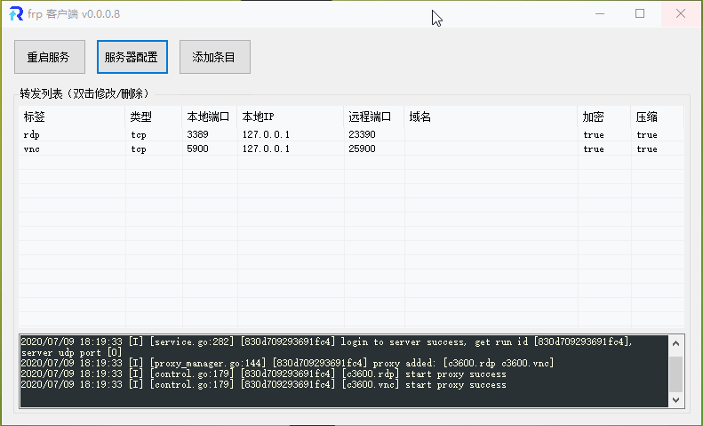

# FrpClient-Win
[](https://github.com/codemonkey-m/FrpClient-Win/blob/master/LICENSE)
[](https://github.com/codemonkey-m/FrpClient-Win/releases)

[frpc](https://github.com/fatedier/frp) 的 Windows GUI 客户端，图形化配置 frpc，以及支持开机启动，仅在 Win10 下测试。  

## 使用

### 目录结构
```
.  
├── FrpClient-Win.exe	// GUI主程序  
├── frpc.exe		// frpc  
├── config.ini		// 配置  
└── autoService.log	// 服务自启日志  
```

### 开机启动
支持两种方式开机启动，两种方式选其一即可，当以服务方式启动时，GUI可退出。  

#### 普通自启
1. Windows 用户登录时，将以 `./FrpClient-Win.exe autorun` 自启。
2. 默认打开 frpc.exe 并最小化到任务栏。  

#### 服务自启
1. 当以管理员身份运行 GUI 时，右键托盘图标可注册到系统服务，实现免 Windows 用户登录自启；生效后 GUI 只起配置作用，可退出。  
2. 服务自启时，日志写入到 `./autoService.log`，未做自动清理，需手动删除。  
3. 你也可以通过 *此电脑 - 管理 - 服务和应用程序 - 服务*，找到 **FrpClient** 项目进行管理。  
4. **如需删除本程序，请先在 GUI 中取消系统服务自启。**  

### 一些技巧
* 服务配置中填入用户标识符，可避免与他人标签冲突  
* 编辑条目时，双击本地IP框，填入 127.0.0.1。  
* 编辑条目时，双击远程端口框，填入 =本地端口。  
* 支持[范围端口映射](https://gofrp.org/docs/features/common/range/)，端口格式如：80-88;443。  
* 支持[热加载配置](https://gofrp.org/docs/features/common/client/#热加载配置文件)(v0.0.1.2+)，需先在 *服务配置 中勾选 开启客户端面板*。  

## 截图



## 贡献者
* @Cp0204  
* @sanshuifeibing
